# 💰 FinanceApp - Smart Personal Finance Tracker
**FinanceApp** adalah solusi pencatatan keuangan pribadi yang dirancang untuk memberikan pengalaman manajemen finansial yang **sederhana**, **intuitif**, dan **aman**. Berbeda dengan aplikasi keuangan lainnya yang memerlukan koneksi internet dan akun, Money Manager hadir dengan konsep **100% offline-first** yang menjamin privasi data Anda tetap terjaga sepenuhnya di perangkat Anda sendiri.

### 💡 Latar Belakang

Di era digital ini, banyak orang kesulitan melacak pengeluaran dan pemasukan mereka. Aplikasi keuangan yang ada sering kali terlalu rumit, memerlukan registrasi akun, atau bahkan menjual data pengguna. **Money Manager** hadir sebagai solusi yang:

- **Sederhana & Mudah Digunakan** - Tidak perlu learning curve yang panjang, langsung pakai dan catat transaksi
- **Privacy-First** - Semua data tersimpan lokal di device, tanpa server, tanpa cloud, tanpa tracking
- **Powerful Analytics** - Meskipun sederhana, dilengkapi dengan visualisasi dan analisis yang mendalam
- **Modern & Beautiful** - User interface yang clean, minimalis, dan nyaman digunakan
- **Gratis & Open Source** - Tanpa iklan, tanpa biaya tersembunyi, dan kode terbuka untuk transparansi

---

## 🛠 Tech Stack

| Technology         | Version | Purpose                          |
| ------------------ | ------- | -------------------------------- |
| Flutter            | ^3.9.2  | Cross-platform framework         |
| Dart               | ^3.9.2  | Programming language             |
| Provider           | ^6.1.1  | State management                 |
| Supabase Flutter   | ^2.3.4  | Backend & Database               |
| Firebase Core      | ^2.24.2 | Firebase integration             |
| Firebase Auth      | ^4.16.0 | Authentication                   |
| Cloud Firestore    | ^4.14.0 | Cloud database                   |
| Firebase Storage   | ^11.6.5 | File storage                     |
| Hive               | ^2.2.3  | Local caching & persistence      |
| FL Chart           | ^0.65.0 | Charts & visualizations          |
| Google Fonts       | ^7.0.0  | Custom typography                |
| Image Picker       | ^1.0.7  | Select & upload images           |
| Intl               | ^0.20.2 | Internationalization & locale    |
| UUID               | ^4.0.0  | Unique identifier generation     |

---

## 📁 Project Structure

```
lib/
├── main.dart                          # Entry point aplikasi
│
├── core/                              # Layer fondasi
│   ├── config/
│   │   └── app_config.dart            # Konfigurasi aplikasi
│   ├── services/
│   │   ├── auth_service.dart          # Autentikasi Supabase
│   │   └── storage_service.dart       # Local storage dengan Hive
│   └── theme/
│       └── app_theme.dart             # Warna, font, styling
│
├── data/                              # Layer data
│   ├── models/
│   │   ├── transaction_model.dart     # Data transaksi (income/expense)
│   │   ├── account_model.dart         # Data akun (bank, dompet)
│   │   ├── category_model.dart        # Kategori transaksi
│   │   ├── budget_model.dart          # Data budget
│   │   └── user_profile_model.dart    # Profil pengguna
│   │
│   └── repositories/                  # Akses API & database
│       ├── supabase_repository.dart   # Akses Supabase
│       ├── auth_repository.dart       # Repository autentikasi
│       └── transaction_repository.dart # Repository transaksi
│
└── presentation/                      # Layer UI
    ├── providers/                     # State management (Provider)
    │   ├── auth_provider.dart
    │   ├── transaction_provider.dart
    │   ├── account_provider.dart
    │   ├── category_provider.dart
    │   ├── budget_provider.dart
    │   └── setting_provider.dart
    │
    ├── screens/                       # Halaman UI
    │   ├── splash_screen.dart
    │   ├── main_screen.dart
    │   ├── auth/
    │   │   ├── login_screen.dart
    │   │   └── register_screen.dart
    │   ├── home/
    │   │   └── home_screen.dart
    │   ├── transaction/
    │   │   ├── transaction_screen.dart
    │   │   └── add_transaction_screen.dart
    │   ├── category/
    │   │   └── category_screen.dart
    │   ├── statistics/
    │   │   └── statistics_screen.dart
    │   └── settings/
    │       └── settings_screen.dart
    │
    └── widgets/                       # Komponen reusable
        ├── transaction_card.dart
        ├── account_card.dart
        ├── category_selector.dart
        └── chart_widget.dart
```

---

## ✨ Fitur Lengkap

### 1️⃣ Pencatatan Transaksi Komprehensif

**FinanceApp** memungkinkan kita mencatat berbagai jenis transaksi dengan detail yang lengkap namun tetap cepat dan mudah.

#### 📝 Tipe Transaksi
- **💸 Pengeluaran (Expense)** - Catat semua pengeluaran Anda mulai dari kebutuhan pokok, hiburan, transportasi, hingga kebutuhan tak terduga
- **💰 Pemasukan (Income)** - Rekam semua sumber pemasukan seperti gaji, bonus, hadiah, atau passive income
- **🔄 Transfer Antar Akun** - Pindahkan saldo dari satu akun ke akun lainnya dengan mudah, balance otomatis terupdate

#### 🎨 Detail Transaksi
- **Nominal Uang** - Input jumlah dengan keyboard numerik yang user-friendly
- **Tanggal & Waktu** - Pilih tanggal dan jam transaksi, bisa untuk transaksi di masa lalu atau dijadwalkan
- **Kategori** - Pilih dari kategori yang sudah ada atau buat kategori custom dengan icon dan warna
- **Akun** - Pilih dari akun mana uang keluar/masuk (Cash, Bank, E-wallet)
- **Catatan** - Tambahkan note/memo untuk setiap transaksi agar lebih jelas
- **Edit & Hapus** - Modifikasi atau hapus transaksi kapan saja dengan update balance otomatis

---

### 2️⃣ Manajemen Multi-Akun

Kelola berbagai jenis akun keuangan Anda dalam satu aplikasi dengan sistem yang terorganisir dan real-time balance tracking.

#### 💳 Jenis Akun

**Assets (Aset):**
- **💵 Cash (Uang Tunai)** 
  - Uang di dompet, laci, celengan
  - Ideal untuk transaksi sehari-hari
  - Mudah dilacak dan dicatat

- **🏦 Bank (Rekening Bank)**
  - Tabungan, giro, deposito
  - Multiple bank accounts support
  - Track saldo rekening bank Anda

- **📱 E-wallet (Dompet Digital)**
  - GoPay, OVO, Dana, ShopeePay, LinkAja
  - QRIS dan payment gateway
  - Sempurna untuk cashless society

**Liabilities (Kewajiban):**
- **📉 Hutang & Cicilan**
  - Kartu kredit, pinjaman bank
  - Cicilan kendaraan, rumah
  - Hutang pribadi
  - Track progress pelunasan

#### ⚙️ Fitur Akun
- **Saldo Awal** - Set initial balance saat membuat akun baru
- **Current Balance** - Balance terupdate otomatis setiap transaksi
- **Icon & Color** - Customizable untuk identifikasi cepat
- **Active/Inactive** - Archive akun yang sudah tidak digunakan
- **Net Worth Calculator** - Total Assets - Total Liabilities

---

### 3️⃣ Sistem Kategori yang Fleksibel

Organisir transaksi Anda dengan sistem kategori yang powerful namun tetap sederhana.

#### 📊 Kategori Bawaan (Default)

**Pengeluaran (Expense):**
- 🍔 **Makanan & Minuman** - Groceries, restoran, kafe, snacks
- 🚗 **Transportasi** - Bensin, parkir, tol, ojek online, transportasi umum
- 🏠 **Rumah Tangga** - Listrik, air, internet, gas, kebersihan
- 👕 **Belanja** - Pakaian, aksesoris, elektronik, gadgets
- 💊 **Kesehatan** - Obat, dokter, rumah sakit, vitamin, asuransi
- 🎓 **Pendidikan** - Sekolah, kursus, buku, pelatihan
- 🎮 **Hiburan** - Streaming, game, bioskop, konser, hobi
- 💇 **Perawatan Diri** - Salon, spa, gym, skin care
- 🎁 **Hadiah & Donasi** - Kado, sedekah, charity
- 📱 **Tagihan** - Pulsa, internet, subscription services
- 🔧 **Lain-lain** - Pengeluaran tak terduga

**Pemasukan (Income):**
- 💼 **Gaji** - Salary, upah bulanan
- 💰 **Bonus** - THR, insentif, komisi
- 💸 **Freelance** - Project sampingan, gig economy
- 🏆 **Hadiah** - Gift, prize, doorprize
- 📈 **Investasi** - Dividen, bunga, capital gain
- 🔧 **Lain-lain** - Sumber income lainnya

#### 🎨 Customization
- **Buat Kategori Baru** - Unlimited custom categories
- **Icon Library** - Pilih dari ratusan icon
- **Color Picker** - Personalisasi dengan warna favorit
- **Edit & Delete** - Kelola kategori sesuai kebutuhan
- **Statistics per Category** - Lihat total pengeluaran per kategori

---

### 4️⃣ Statistik & Visualisasi Data

Pahami pola keuangan Anda dengan berbagai grafik dan chart yang informatif dan interaktif.

#### 📊 Grafik & Charts

**1. Summary Dashboard**
- **Monthly Overview** - Ringkasan pengeluaran dan pemasukan bulan ini
- **Net Balance** - Selisih income vs expense
- **Comparison** - Perbandingan dengan bulan sebelumnya
- **Trend Indicator** - Naik/turun dengan persentase

**2. Pie Chart (Donut Chart)**
- **Breakdown by Category** - Visualisasi pengeluaran per kategori
- **Percentage View** - Lihat proporsi tiap kategori dalam persen
- **Interactive** - Tap untuk lihat detail kategori
- **Color-coded** - Sesuai warna kategori yang dipilih

**3. Line Chart (Trend Analysis)**
- **Daily Spending** - Grafik pengeluaran harian
- **Weekly Comparison** - Perbandingan minggu ke minggu
- **Monthly Trend** - Tren keuangan bulanan
- **Smooth Curve** - Visualisasi yang smooth dan eye-pleasing

**4. Bar Chart (Histogram)**
- **Expense Distribution** - Distribusi pengeluaran per hari
- **Income vs Expense** - Comparison chart
- **Peak Days** - Hari dengan pengeluaran tertinggi

#### 📅 Calendar View
- **Monthly Calendar** - Lihat transaksi dalam bentuk kalender
- **Highlight Dates** - Tanggal dengan transaksi di-highlight
- **Daily Summary** - Tap tanggal untuk lihat detail transaksi
- **Navigation** - Swipe untuk pindah bulan

#### 📈 Advanced Analytics
- **Total Expense** - Jumlah pengeluaran periode tertentu
- **Total Income** - Jumlah pemasukan periode tertentu
- **Average Daily Spending** - Rata-rata pengeluaran per hari
- **Largest Transaction** - Transaksi terbesar
- **Most Used Category** - Kategori paling sering digunakan
- **Top Spending Days** - Hari-hari dengan pengeluaran tertinggi

---

### 5️⃣ Settings & Personalization

Customize aplikasi sesuai preferensi Anda dengan pengaturan yang simpel namun powerful.

#### 👤 Profile Management

**Personal Information:**
- **Profile Photo** 
  - Upload dari gallery atau ambil dari kamera
  - Crop & resize otomatis
  - Remove photo option
  
- **Name** 
  - Display name yang muncul di aplikasi
  - Editable kapan saja
  
- **Email** (Optional)
  - Untuk identifikasi atau backup info
  - Tidak diperlukan untuk login

#### 🎨 Basic Settings

**1. Theme (Appearance)**
- **🌞 Light Mode** - Tema terang untuk siang hari
- **🌙 Dark Mode** - Tema gelap yang nyaman untuk mata
- **🔄 System** - Follow system theme automatically
- Material Design 3 implementation
- Smooth transition between themes

**2. 💱 Currency**
- **Supported Currencies:**
  - 🇮🇩 IDR (Indonesian Rupiah)
  - 🇺🇸 USD (US Dollar)
  - 🇪🇺 EUR (Euro)
  - 🇬🇧 GBP (British Pound)
  - 🇯🇵 JPY (Japanese Yen)
  - 🇸🇬 SGD (Singapore Dollar)
  - 🇲🇾 MYR (Malaysian Ringgit)
- Auto format dengan symbol currency
- Thousand separator

**3. 🌐 Language**
- **🇮🇩 Bahasa Indonesia** - Full Indonesian translation
- **🇺🇸 English** - Default language

**4. 📅 Date Format**
- **dd/MM/yyyy** - Indonesian style (09/01/2025)
- **MM/dd/yyyy** - US style (01/09/2025)
- **yyyy-MM-dd** - ISO format (2025-01-09)
- Consistent date display across app

---

## 🎬 Demo

<p align="center">
  
</p>

---

## 📸 Screenshots

Berikut adalah tampilan aplikasi Money Manager Mobile:

### Auth Screens

<table>
  <tr>
    <td align="center"><b>Login</b></td>
    <td align="center"><b>Register</b></td>
    <td align="center"><b>Splash</b></td>
  </tr>
  <tr>
    <td>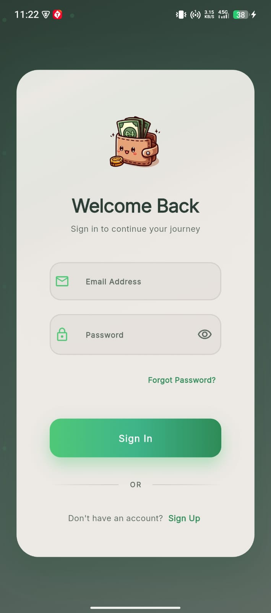</td>
    <td>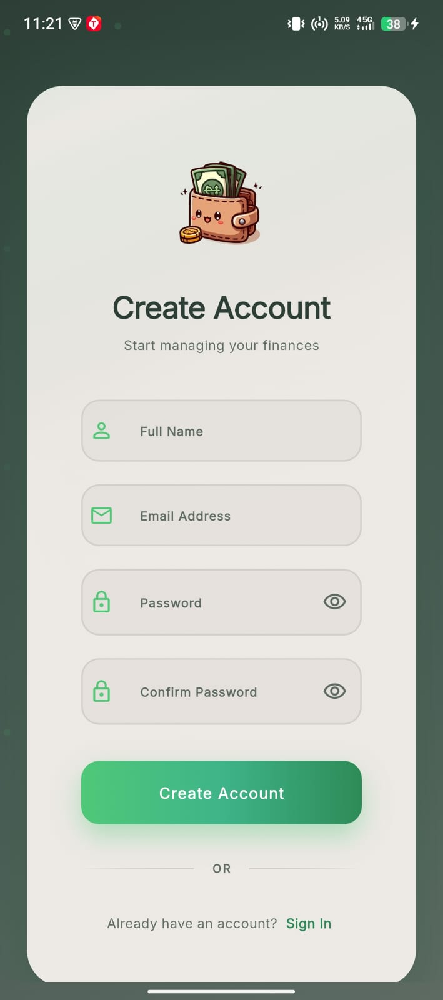</td>
    <td>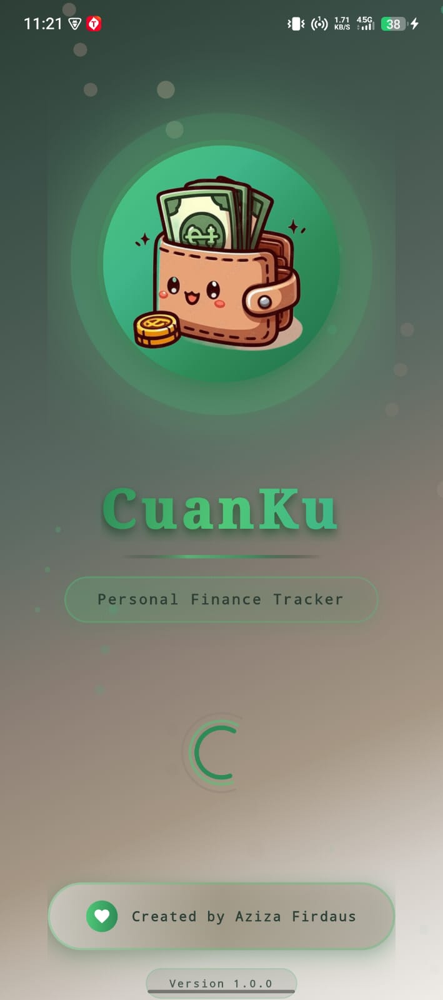</td>
  </tr>
</table>

### Main Screens

<table>
  <tr>
    <td align="center"><b>Dashboard Home</b></td>
    <td align="center"><b>Transaction List</b></td>
    <td align="center"><b>Account Management</b></td>
  </tr>
  <tr>
    <td>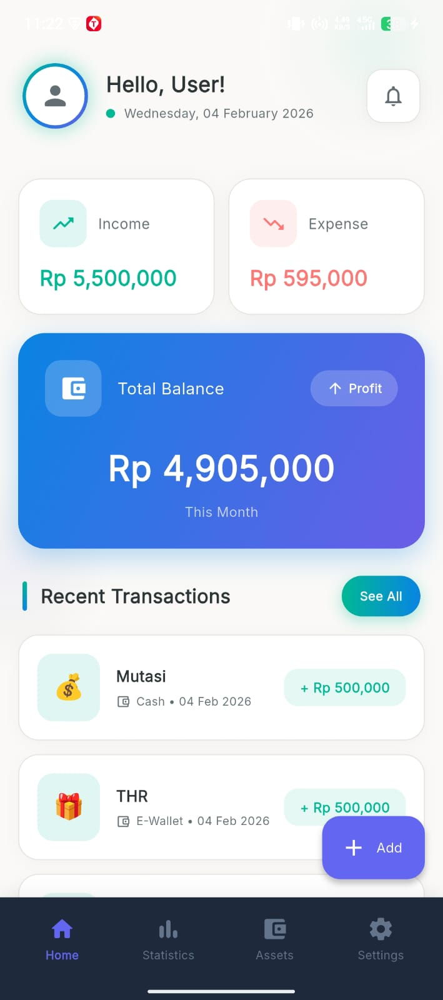</td>
    <td>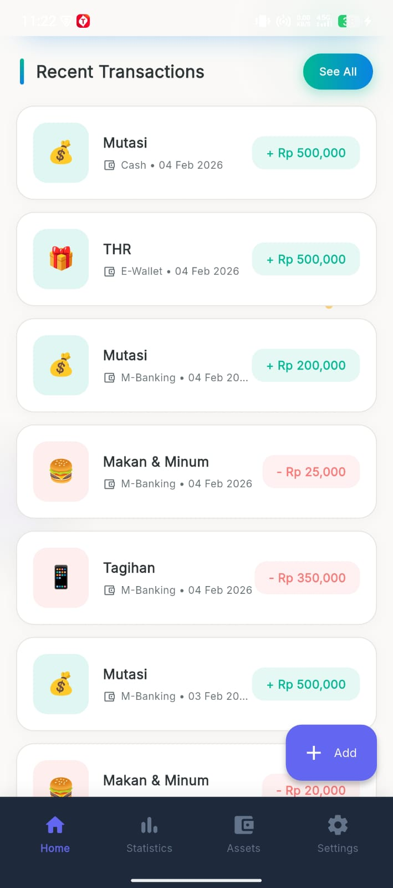</td>
    <td>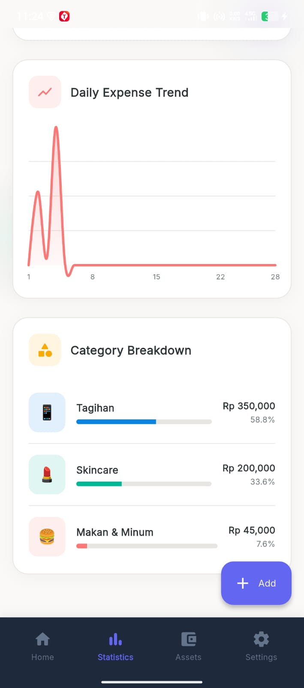</td>
  </tr>
</table>

### Financial Features

<table>
  <tr>
    <td align="center"><b>Income</b></td>
    <td align="center"><b>Expense</b></td>
    <td align="center"><b>Transfer</b></td>
  </tr>
  <tr>
    <td></td>
    <td>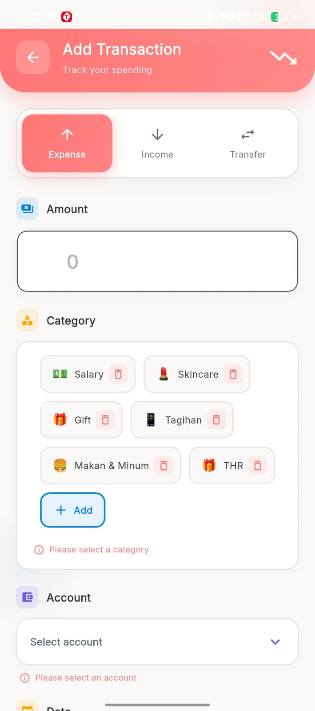</td>
    <td>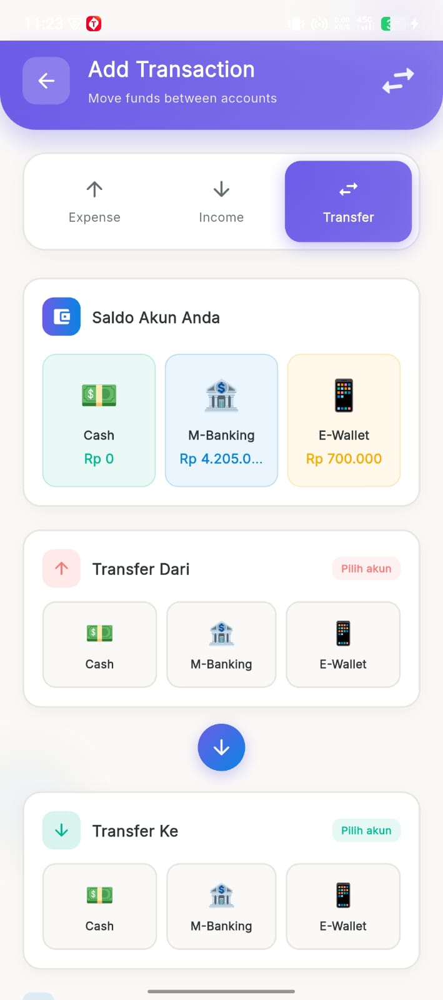</td>
  </tr>
</table>

<table>
  <tr>
    <td align="center"><b>Asssets</b></td>
    <td align="center"><b>Liabilitas</b></td>
    <td align="center"><b>Statistics</b></td>
  </tr>
  <tr>
    <td>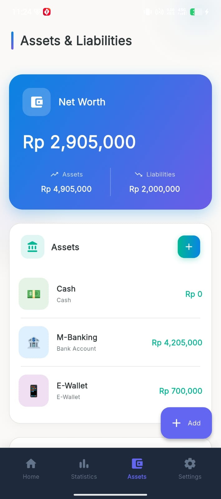</td>
    <td>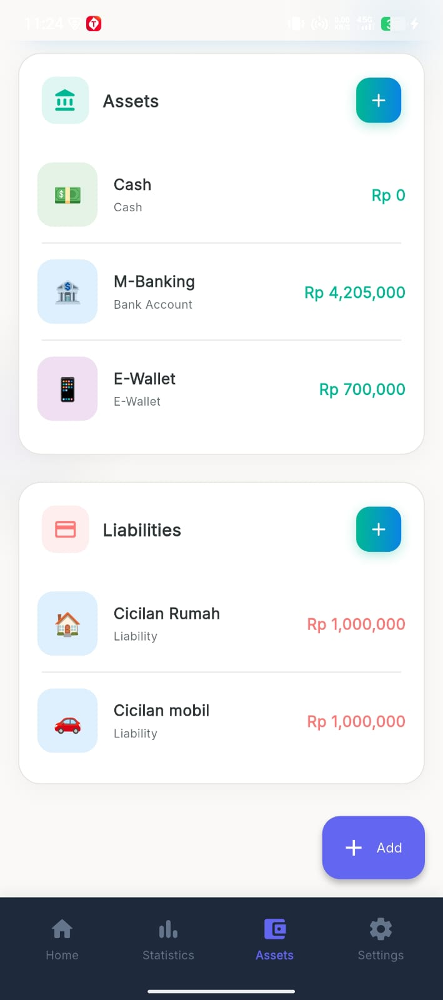</td>
    <td>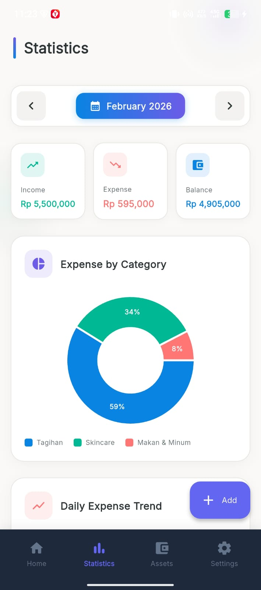</td>
  </tr>
</table>

### Settings & Profile

<table>
  <tr>
    <td align="center"><b>User Profile</b></td>
    <td align="center"><b>Settings</b></td>
  </tr>
  <tr>
    <td>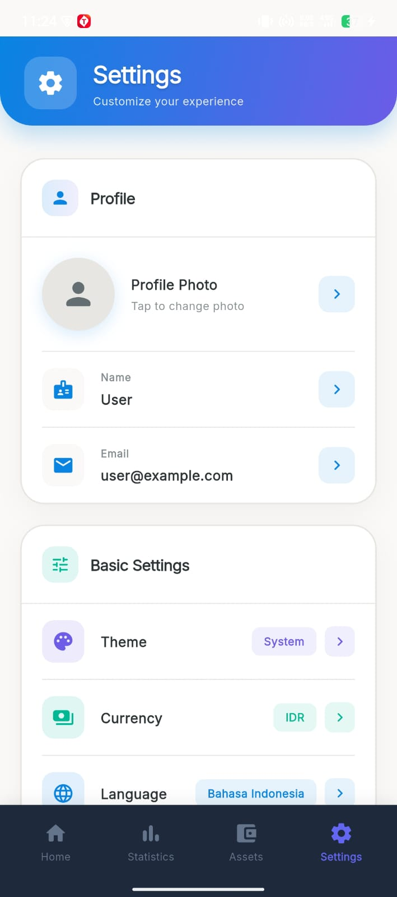</td>
    <td>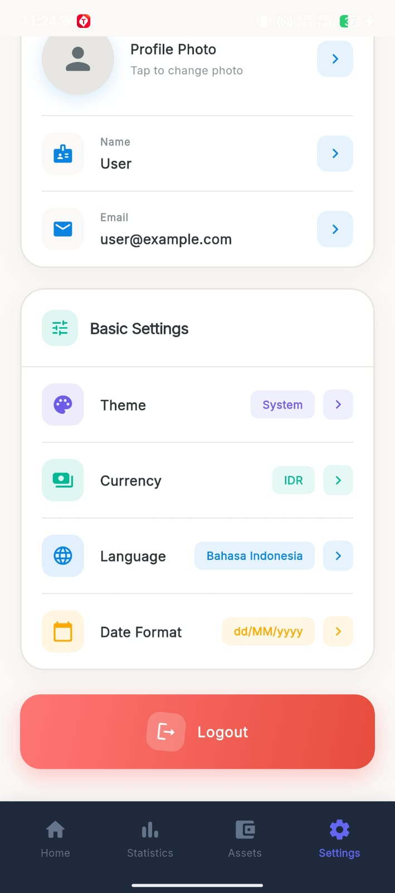</td>
  </tr>
</table>

---

<div align="center">

**FinanceApp - Take Control of Your Financial Future** 💰✨

*Project dalam proses pengembangan*

</div>
